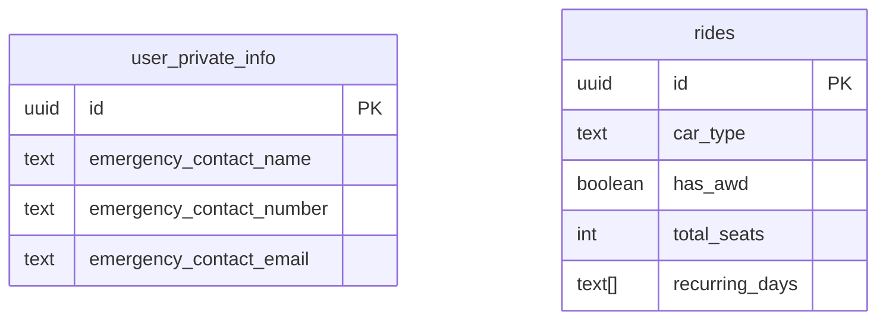
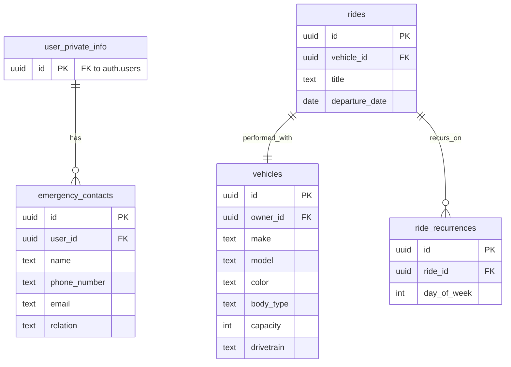

# Entity Relationship Diagram Changes

## Before Normalization (Conceptual)

```mermaid
erDiagram
    user_private_info {
        uuid id PK
        text emergency_contact_name
        text emergency_contact_number
        text emergency_contact_email
    }
    rides {
        uuid id PK
        text car_type
        boolean has_awd
        int total_seats
        text[] recurring_days
    }
```

## After Normalization (3NF)

```mermaid
erDiagram
    user_private_info ||--o{ emergency_contacts : "has"
    user_private_info {
        uuid id PK "FK to auth.users"
    }

    emergency_contacts {
        uuid id PK
        uuid user_id FK
        text name
        text phone_number
        text email
        text relation
    }

    vehicles {
        uuid id PK
        uuid owner_id FK
        text make
        text model
        text color
        text body_type
        int capacity
        text drivetrain
    }

    rides ||--|| vehicles : "performed_with"
    rides ||--o{ ride_recurrences : "recurs_on"

    rides {
        uuid id PK
        uuid vehicle_id FK
        text title
        date departure_date
    }

    ride_recurrences {
        uuid id PK
        uuid ride_id FK
        int day_of_week
    }
```
